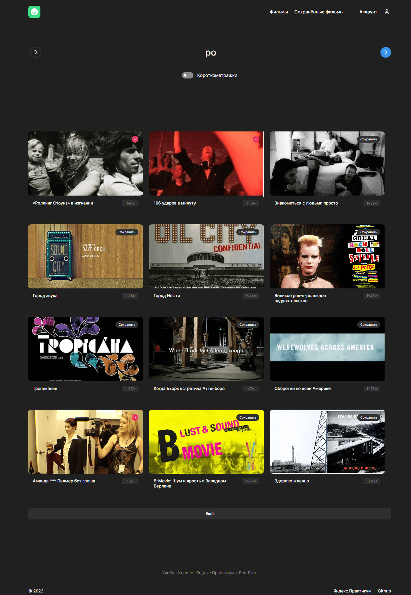
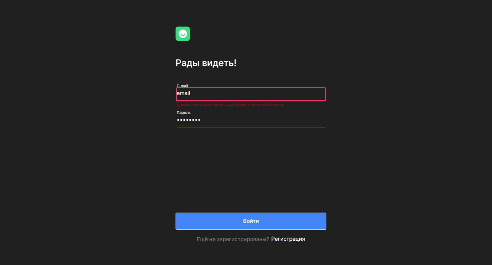

# movies-explorer-frontend
## Фронтенд дипломной работы по курсам от Яндекс Практикума
-----
**_Содержание файла README.md_**

<a href="#description">Описание</a>
 
<a href="#links">Ссылки на проект</a>
 
<a href="#figma">Ссылка на макет в Figma</a>
 
<a href="#demo">Демонстрация</a>
 
<a href="#file_structure">Файловая структура</a>
 
<a href="#technologies">Использованные технологии</a>
 
<a href="#functionality">Функциональность</a>

<h2>Описание</h2>

Данный дипломный проект реализован и запущен с помощью Create React App и представляет собой сервис Movies на Реакте: интерактивную страницу, отображающую карточки фильмов. 
В каталоге проекта его можно запустить командой 'npm start movies-explorer-frontend'.

<h2>Ссылки на проект</h2>

Адрес репозитория: Frontend https://github.com/AlmatAnastasia/movies-explorer-frontend 
IP: 158.160.63.218 
Frontend:  https://almatanastasia.diploma.fr.nomoreparties.sbs

Pull request: https://github.com/AlmatAnastasia/movies-explorer-frontend/pull/2

<h2>Ссылка на макет в Figma</h2> 

<a href="https://drive.google.com/file/d/19CypQ1yIBmWpqY8NOTTfrFZ1qE5oxUHf/view?usp=sharing">Макет</a>.

<h2>Демонстрация</h2>
<h3>Ссылка на сайт <a href="https://almatanastasia.github.io/react-mesto-auth/">тут</a> !</h3>

<h2>Файловая структура</h2>
<pre>
.
├── public             # HTML 
├── src                # CSS, JS-файлы, шрифты и изображения 
├── .gitignore         # Файл для игнорирования/предотвращения передачи файлов 
├── .nojekyll          # Пустой файл для публикации на GitHub Pages 
├── package-lock.json  # Файл блокировки, содержащий информацию о зависимостях/пакетах с их точными номерами версий 
├── package.json       # Файл управления версиями, используемый для установки нескольких пакетов в проекте 
├── README.md          # Файл документации проекта 
</pre>
<h2>Файловая структура директории public</h2>
<pre>
.
└── index.html      # Главная страница сервиса
</pre>
<h2>Файловая структура директории src</h2>
<pre>
.
├── blocks          # Файлы стилей блоков 
├── components      # Файлы компонентов 
├── contexts        # Файлы с объектами контекста 
├── hooks           # Файлы с кастомными хуками 
├── images          # Файлы изображений 
├── utils           # Файлы утилитарных модулей (отдельные функции и константы) 
├── vendor          # Файлы сторонних библиотек 
├── index.css       # Файл стилей 
└── index.js        # Основной JavaScript файл, выполняющий развёртывание React-приложения
</pre>
<h2>Файловая структура директории vendor</h2>
<pre>
.
├── fonts           # Файлы шрифтов 
├── normalize.css   # CSS-файл, обеспечивающий для HTML-элементов лучшую кроссбраузерность в стилях по умолчанию 
</pre>

<h2>Использованные технологии</h2>

⬥ HTML 
⬥ CSS 
⬥ JS 
⬥ React 
⬥ Git 
⬥ Express.js 
⬥ mongoDB

<h2>Функциональность</h2>

✶ Навигация по страницам:

1. / — страница «О проекте», основная функциональность приложения

2. /movies — страница «Фильмы»

3. /saved-movies — страница «Сохранённые фильмы»

4. /profile — страница страница с профилем пользователя

5. /sign-up — регистрация пользователя

6. /sign-in — авторизация пользователя

7. * — Страница Not Found

✶ Карточки фильмов

✶ Меню с навигацией на сайте

✶ Два состояния кнопок: обычное и при наведении
